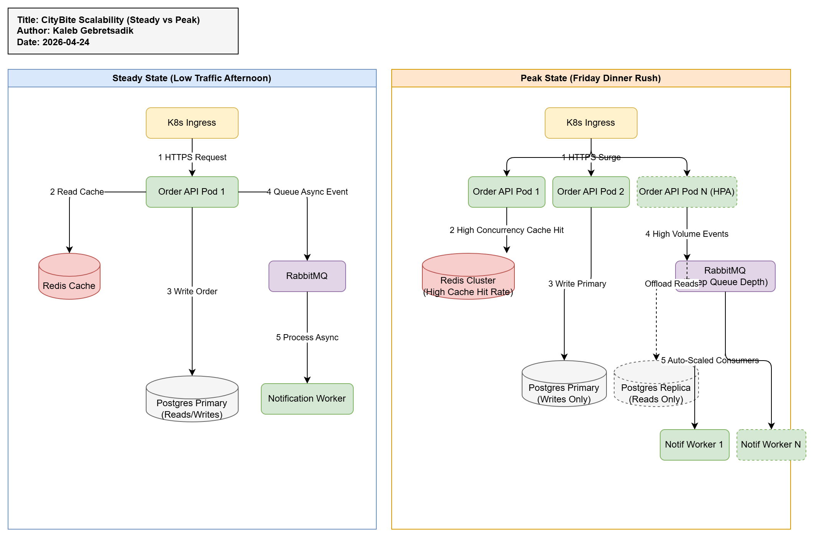

# Assignment Submission: Lecture 10 (CityBite Scalability)

**Student Name**: Kaleb Gebretsadik  
**Student ID**: [30008744]  
**Submission Date**: [4/24/2026]

## Overview
This submission provides a comprehensive architectural assessment of **CityBite's Scalability** during peak demand. Applying the principles of **Chapter 10: Scalability**, the architecture explicitly highlights the tension between computationally bound, horizontally scalable API pods and connection-bound, vertically scaled databases. It covers critical mitigations like strict connection pooling, Redis caching, event-driven Message Queuing, and HPA auto-scaling thresholds.

## Files Included

### Part 1: Workload Model and Bottlenecks
- `part1_workload_and_bottlenecks.md`: Maps out the five core workload dimensions (concurrent customers, orders per minute, etc.) identifying exactly which system resources (CPU vs DB Connections) saturate first. Discusses the Friday 19:00 "Hero Scenario".
- `part1_scale_decisions.md`: A decision log contrasting Scale-Up vs Scale-Out options for four subsystems (API Pods, DB, Workers, and Storage).

### Part 2: Architecture Under Growth
- `part2_data_scaling.md`: Details the synchronous, strongly consistent write path (for transactions) vs the asynchronous, eventually consistent event queues (for notifications and analytics). Discusses the write-through cache strategy via Redis.
- `part2_architecture_steady_vs_peak.drawio` / `.png`: A visual side-by-side infrastructure diagram contrasting CityBite's minimal steady-state footprint against its heavily elastic, read-replica driven peak footprint.

### Part 3: Patterns, Limits, and Operations
- `part3_patterns.md`: Checklists the application of common scalability patterns (Load Balancing, Master/Worker, Scatter/Gather) and addresses multi-tenant fairness logic.
- `part3_autoscaling_and_limits.md`: Defines the Kubernetes HPA parameters for the Order API and details the catastrophic failure cascade that occurs if stateless pods scale infinitely while ignoring stateful database constraints.

## Architecture Diagram (Steady State vs Peak)

