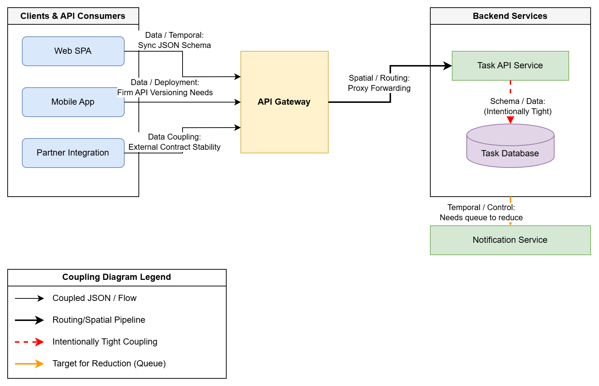

# Part 1.1: Coupling Inventory

## 1. System Elements and Dependencies

### 1) Web SPA → API Gateway / Task API
- **Direction:** Web SPA depends on the API Gateway / Task API.
- **Type of Coupling:** **Data Coupling** and **Temporal Coupling**. The SPA parses the exact JSON schema provided over a synchronous HTTP connection.
- **Ripple Effect:** If the API changes a field name in the JSON response (e.g., renaming `done` to `completed`), the Web SPA's data binding and UI will break immediately because it still looks for `task.done`.

### 2) Mobile App → API Gateway / Task API
- **Direction:** Mobile App depends on the API Gateway.
- **Type of Coupling:** **Data Coupling** and severe **Deployment Runtime Coupling**.
- **Ripple Effect:** Mobile apps cannot be updated instantly across all devices. If the Gateway suddenly requires a new header (`X-Client-Id`), existing mobile installations will receive 400 or 401 errors. This breaks the app for users until they download an update from the app store.

### 3) Partner Integrations → API Gateway
- **Direction:** Partner Integrations depend on our API Gateway.
- **Type of Coupling:** **Data Coupling**. We do not control their release cycle or error handling logic.
- **Ripple Effect:** If we enforce a new constraint (such as reducing `title` length from 500 to 100 characters), automated partner bots submitting 300-character workflows will suddenly encounter 400 Bad Request errors, breaking their integrations silently.

### 4) Task API → Task Store (Database)
- **Direction:** Task API depends on the Task Store.
- **Type of Coupling:** **Schema/Representation Coupling** and **Data Coupling**.
- **Ripple Effect:** If the database schema is modified (e.g., deleting a column or changing a primary key to a UUID), the Task API's SQL statements or ORM models will throw exceptions and cause 500 Internal Server errors.

### 5) Task API → Notification Service
- **Direction:** Task API depends on the Notification Service.
- **Type of Coupling:** **Control Coupling** and **Temporal Coupling** (assuming synchronous REST calls).
- **Ripple Effect:** If the Notification server goes offline or gets bogged down during peak hours, the temporal coupling causes the Task API's threads/requests to hang waiting for a response, leading to global timeouts across the entire platform.

---

## 2. Intentional vs. Reduced Coupling

### Intentionally Tight Coupling (Acceptable Trade-offs)
1. **Task API and Task Store:** Attempting to completely decouple a REST API from its backing database schema usually results in excessive layers of mapping and poor performance. In typical micro-services, the API's tight structural coupling to its domain datastore is standard and acceptable.
2. **Web SPA and Task API JSON format:** Modifying the backend logic to continuously support older JSON shapes specifically for the Web SPA is often unnecessarily complex because Web SPAs can be deployed almost instantaneously in lockstep with backend releases.

### Places to Reduce Coupling
1. **Task API and Notification Service:** I would reduce coupling by removing the direct HTTP call and switching to an **Asynchronous Message Queue** (e.g., Kafka or RabbitMQ). This breaks temporal coupling. The Task API instantly publishes a "Task Created" event and returns 201 to the user; the Notification service reads from the queue at its own pace.
2. **Gateway and Mobile/Partner Clients:** I would reduce strict deployment coupling through the use of **API Versioning** (`/v1/` vs `/v2/`). By forcing versioning boundaries at the Gateway, we allow backend teams to deploy breaking data schema changes to v2 without interrupting partners or older iOS devices safely communicating with v1.

---

## 3. Coupling Diagram

