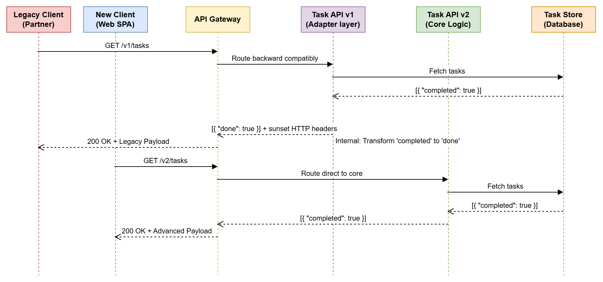

# Part 3.1: Task API Compatibility & Governance Policy

This document outlines the strict API governance, versioning semantics, and deprecation lifecycle for the Task API. All teams (Internal and Partner Developer groups) must adhere to these guidelines to ensure massive scalability without interrupting active business integrations.

## 1. Defining Additive vs. Breaking Changes

To maintain strict contract stability, we categorize all deployments based on semantic impact:

### Additive (Non-Breaking) Changes
These updates will be pushed directly to the active API version and will trigger a **MINOR** or **PATCH** version bump.
- Adding completely new endpoints (e.g., `/tasks/bulk`).
- Adding new optional fields to existing request/response payloads (e.g., `priority`).
- Relaxing input definitions (e.g., increasing `title` length from 100 to 500 characters).
- Adding new optional headers.

*Client Expectation:* All clients **must** be written to employ permissive JSON deserialization. Clients throwing fatal errors upon encountering unknown JSON keys will not be considered "broken by us," as they violated the permissive consumption policy.

### Breaking Changes
These updates will **never** be pushed to an active stable version. They mandate a routing prefix bump (e.g., `/v1/` → `/v2/`) triggering a **MAJOR** release.
- Renaming or removing existing fields (e.g., `done` to `completed`).
- Tightening data constraints (e.g., lowering `title` max length from 500 to 100).
- Adding new strictly required headers or authentication demands (e.g., `X-Client-Id`).
- Changing data types of existing fields.

## 2. Deprecation and Sunset Process

When rolling out a MAJOR version (e.g., v2), the previous version (v1) instantly enters the "Deprecation Window."

- **Notice Period:** We strictly guarantee a **12-month** active uptime grace period for major version cutovers, and a **6-month** window for minor deprecated endpoint transitions.
- **Communication Channels:** 
  1. Emails triggered via our Developer Portal registry.
  2. Documentation alerts prominently pinned on our Swagger/OpenAPI docs.
- **HTTP Spec Signaling:** Once an endpoint enters deprecation, edge routers will aggressively inject `Deprecation: true` and a standardized `Sunset: <Date>` HTTP header into every single response, allowing programmatic integration health monitors to flag sunsets dynamically.

## 3. Error Format Stability 

Integrators heavily rely on programmatic error interception. Therefore, our error contracts are rigidly governed:
- **Structural Integrity:** The JSON schema for errors `{"error": { "code": string, "message": string }}` is immutable across a major version.
- **Error Codes are Contracts:** The `error.code` string (e.g., `"VALIDATION_ERROR"`) is treated as an Enum constraint. It will **never** be renamed or deleted without a MAJOR version break.
- **Error Messages are Ephemeral:** The `error.message` string is strictly intended for human debugging. It may be reworded, translated, or expanded at any moment during a minor patch. Clients must *never* execute business logic using regex checks against the `message` string.

## 4. First-Party vs. Partner Integrations

While the API contract structure handles everyone identically, operational empathy differs depending on the client scope:
- **First-Party Internal Apps (Web SPA):** Because we have full spatial deployment control over internal UI clients, we will continuously migrate our Web SPA in lock-step with backend releases (often utilizing zero-downtime blue/green deployment). The SPA will always consume the bleeding-edge latest version.
- **Mobile Apps & External Partners:** Mobile Apps (hampered by App Store review/download delays) and third-party commercial partners have significantly slower deployment pipelines. Because they cannot update immediately, they represent the primary reason our 12-month Sunset Policy exists. We vow to never forcefully rotate an API version without honoring the full SLA sunset duration, regardless of internal technical debt pressures.

---

## 5. Migration Sequence Diagram

